# 🧠 Student Team Hub

A full-stack MERN application to manage and showcase student team members with profile pictures, editable details, and search functionality. Built using basic React, Node.js, Express,and MongoDB (no third-party styling or libraries beyond essentials).

---

## 📘 Project Description

Student Team Hub allows users to:

- Add team members with profile image and personal/professional details
- View all team members in a responsive grid
- Search members by name or role
- Edit or delete member details
- Toggle light/dark mode from the navbar
- Store member data in a local MongoDB instance

---

## 🛠️ Installation Steps

1. **Clone this repository**  
   ```bash
   git clone https://github.com/Ayush-Mukherjee1105/Team-APEX.git
   cd student-team-hub

2. **Install backend dependencies**
    ```bash
    cd backend
    npm install

3. **Install frontend dependencies**
    ```bash
    cd frontend
    npm install

4. **Set up .env file in backend/ folder**
    Create a .env file inside the backend/ directory with the following:
    ```bash
    MONGODB_URI='Your-MONGO_URI'
    PORT=

5. **Start MongoDB locally**
    Make sure MongoDB is running locally. You can use:  
    ```bash
    mongod

---

## API ENDPOINTS
| Method | Endpoint           | Description                          |
| ------ | ------------------ | ------------------------------------ |
| GET    | `/api/members`     | Get all team members                 |
| GET    | `/api/members/:id` | Get single member by ID              |
| POST   | `/api/members`     | Add new member (multipart/form-data) |
| PUT    | `/api/members/:id` | Update member details                |
| DELETE | `/api/members/:id` | Delete a member                      |

---

## How To Run the App

1. **Run Backend**
    ```bash
    cd backend
    npm start

2. **Run frontend**
    ```bash
    cd frontend
    npm start

---

## Screenshots
Home Page:
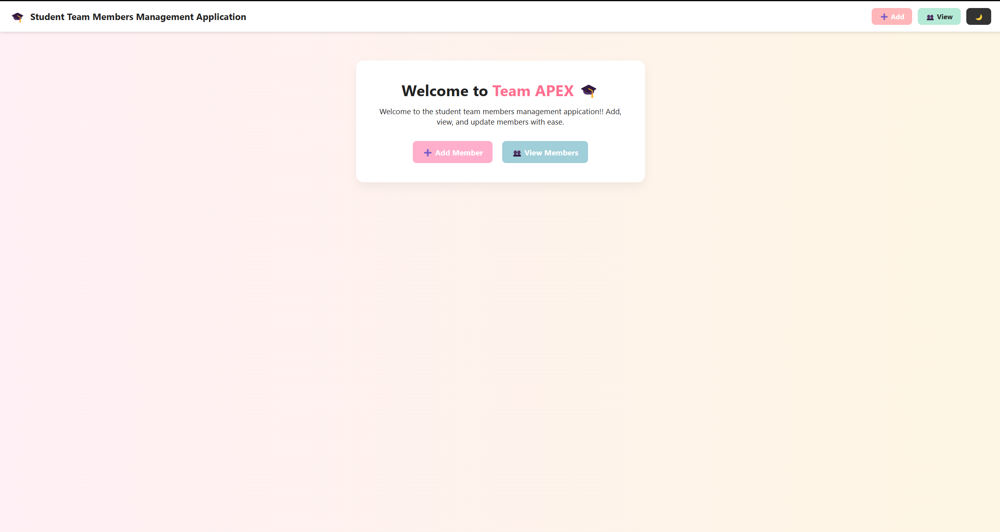

Add Members:
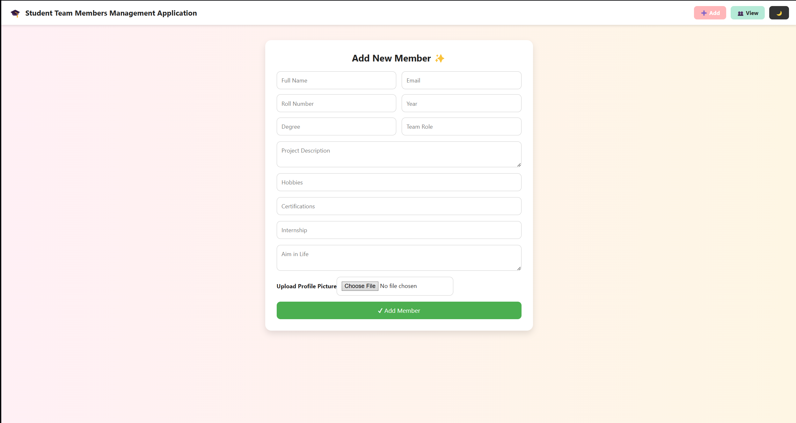

View Members:
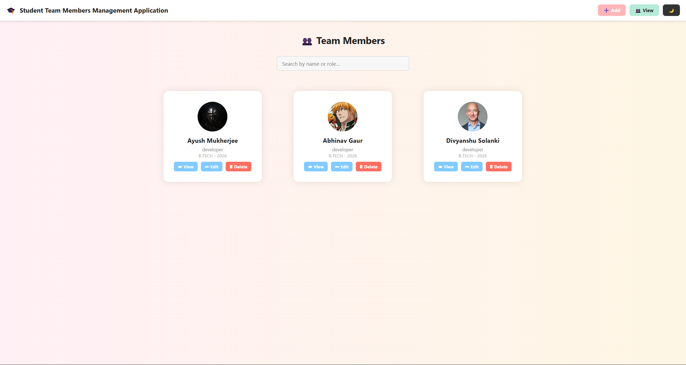

View Members, Darkmode:
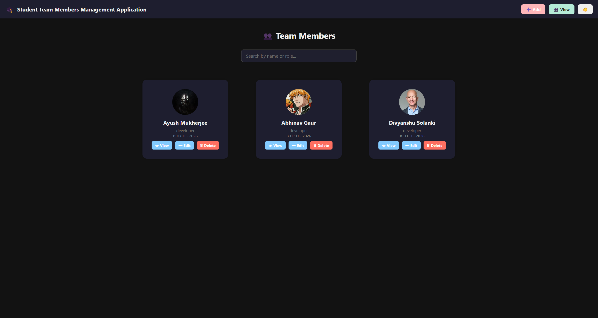

Homage Pages, Darkmode:
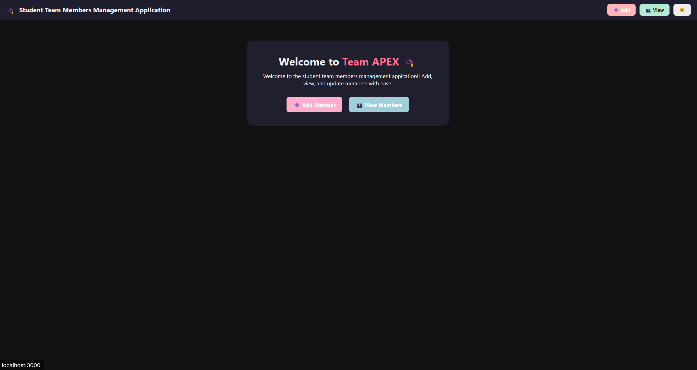

Add Members, Darkmode:
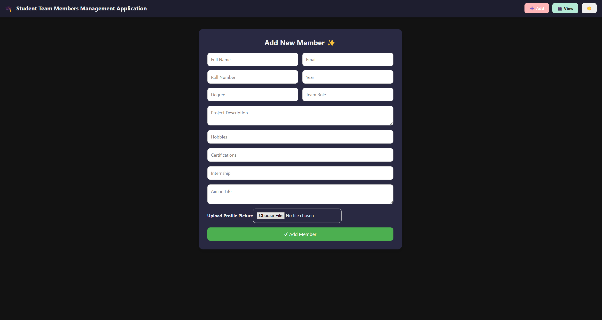

Member Details, Darkmode:
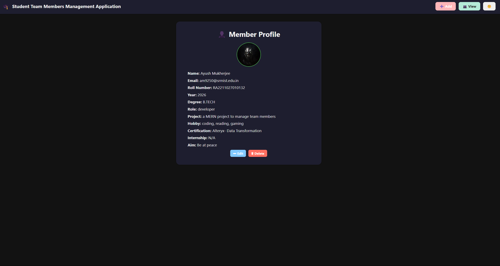

Member Details:
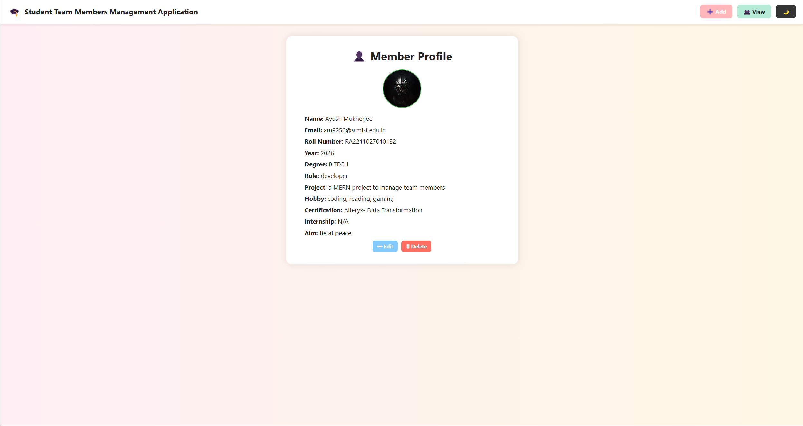

Edit Member Details:
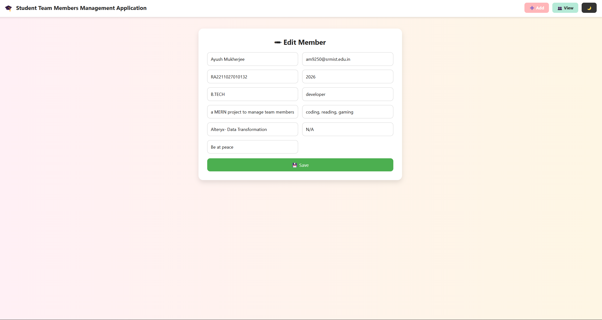

Edit Member Details, Darkmode:


api call on browser, 
GET /api/members:
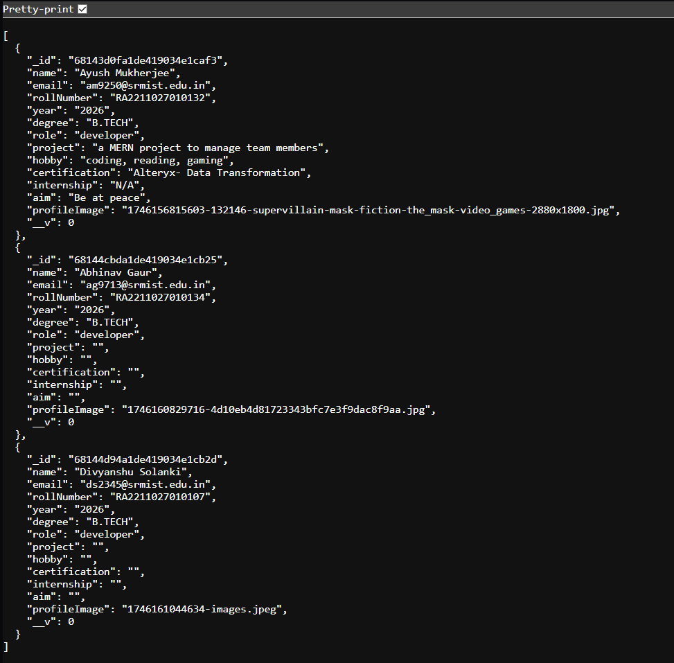

GET /api/members/:id :
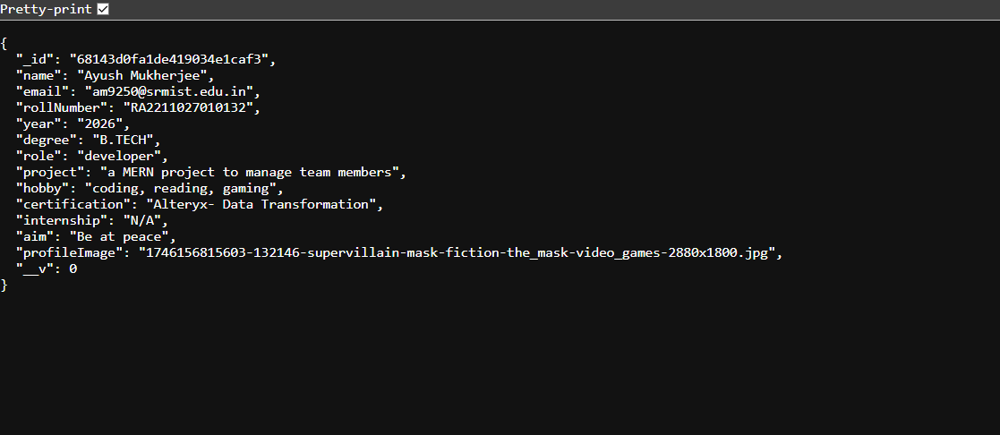
